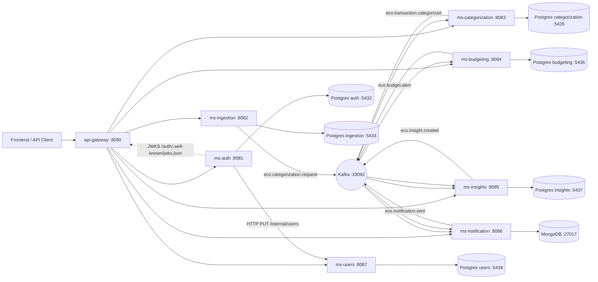

# 🌱 EcoFy — Financial Automation & Data Intelligence Platform
## 🌱 EcoFy — Plataforma de Automação Financeira e Inteligência de Dados

> **📌 Status / Maturidade:** projeto de **portfólio/estudos** com práticas profissionais (arquitetura hexagonal, testes, segurança JWT/JWKS, event‑driven). Alguns provedores e integrações externas são **stubs/placeholders** claramente marcados. Ver **[Limitações](#-known-limitations--limitações-conhecidas)** e **[Roadmap](#-roadmap--roadmap)**.
>
> **📌 Status / Maturity:** a **portfolio/study** project built with professional practices (hexagonal architecture, tests, JWT/JWKS security, event‑driven). Some external providers/integrations are **stubs/placeholders**, clearly flagged. See **[Known Limitations](#-known-limitations--limitações-conhecidas)** and **[Roadmap](#-roadmap--roadmap)**.

---

## 📌 Overview | Visão Geral

**EN:** **EcoFy** is a backend platform based on **event-driven microservices**, designed to **organize, centralize, and transform raw financial data** (bank statements, transactions, financial events) into **structured, categorized, and actionable information**. It simulates how **fintechs, digital banks, and financial-management platforms** process financial data with **security, traceability, and modularity**.

**PT:** O **EcoFy** é uma plataforma backend orientada a **microsserviços e eventos**, projetada para **organizar, centralizar e transformar dados financeiros brutos** (extratos, transações e eventos) em **informações estruturadas, categorizadas e acionáveis**. Simula como **fintechs, bancos digitais e plataformas de gestão financeira** processam dados com **segurança, rastreabilidade e isolamento de responsabilidades**.

---

## 🎯 What the Platform Does | O que a Plataforma Faz

**EN:** EcoFy enables users and integrated systems to:
- import bank files (CSV / OFX) and ingest financial events;
- categorize transactions automatically (rules) or manually;
- manage budgets and spending limits, tracking consumption;
- generate insights, metrics, trends and dashboards;
- trigger multichannel notifications from financial events.

**PT:** O EcoFy permite que usuários e sistemas integrados:
- importem arquivos bancários (CSV / OFX) e ingiram eventos financeiros;
- categorizem transações automaticamente (regras) ou manualmente;
- gerenciem orçamentos e limites de gastos, acompanhando o consumo;
- gerem insights, métricas, tendências e dashboards;
- disparem notificações multicanal a partir de eventos financeiros.

> **EN:** In short — EcoFy turns unstructured financial data into actionable knowledge.
> **PT:** Em resumo — o EcoFy transforma dados financeiros desestruturados em conhecimento acionável.

---

## 🧭 Architecture Overview | Visão Geral da Arquitetura

**EN:** Event-driven architecture with **Kafka** as the central event bus, a single **API Gateway** entry point, and **JWT/JWKS** authentication issued by `ms-auth` and validated by each service (OAuth2 Resource Server). Every service follows **Hexagonal Architecture (Ports & Adapters)** — the domain has no dependency on Spring/JPA/Kafka.

**PT:** Arquitetura orientada a eventos com **Kafka** como barramento central, **API Gateway** como ponto único de entrada e autenticação **JWT/JWKS** emitida pelo `ms-auth` e validada por cada serviço (OAuth2 Resource Server). Todos os serviços seguem **Arquitetura Hexagonal (Ports & Adapters)** — o domínio não depende de Spring/JPA/Kafka.

A detailed C4 context diagram is available at **[docs/architecture/c4-context.md](docs/architecture/c4-context.md)**.

### 🗺️ System Diagram (implemented components) | Diagrama do Sistema (componentes implementados)



> **EN:** *Planned infrastructure not yet implemented:* Redis (cache/idempotency hot-reads), OpenSearch (search), Schema Registry. Referenced in the roadmap only.
> **PT:** *Infraestrutura planejada ainda não implementada:* Redis (cache/idempotência), OpenSearch (busca), Schema Registry. Apenas no roadmap.

---

## 🧩 Microservices | Microsserviços

| Service | Port | context-path | Responsibility (EN) | Responsabilidade (PT) | README |
|---|---:|---|---|---|---|
| **api-gateway** | 8080 | — | Single HTTP entry point, static routing, preserves `Authorization` | Entrada HTTP única, roteamento estático, preserva `Authorization` | [↗](api-gateway/README.md) |
| **ms-auth** | 8081 | `/auth` | AuthN/AuthZ (OIDC/JWT RS256), JWKS, register/login/refresh/validate | AutenticAção/AutorizAção (JWT RS256), JWKS, registro/login/refresh/validate | [↗](ms-auth/README.md) |
| **ms-users** | 8087 | `/users` | Profiles, preferences, connections, sync from ms-auth | Perfis, preferências, conexões, sync do ms-auth | [↗](ms-users/README.md) |
| **ms-ingestion** | 8082 | `/ingestion` | CSV/OFX upload, ImportJob, RawTransaction, publishes categorization requests | Upload CSV/OFX, ImportJob, RawTransaction, publica pedidos de categorização | [↗](ms-ingestion/README.md) |
| **ms-categorization** | 8083 | `/categorization` | Auto/manual categorization, publishes categorized events | Categorização auto/manual, publica eventos categorizados | [↗](ms-categorization/README.md) |
| **ms-budgeting** | 8084 | `/budgeting` | Budgets, BudgetConsumption, BUDGET_ALERT | Orçamentos, BudgetConsumption, BUDGET_ALERT | [↗](ms-budgeting/README.md) |
| **ms-insights** | 8085 | `/insights` | Dashboard, goals, metrics, insight.created | Dashboard, goals, métricas, insight.created | [↗](ms-insights/README.md) |
| **ms-notification** | 8086 | `/notification` | Multichannel notifications (stub providers), templates, delivery attempts | Notificações multicanal (providers stub), templates, tentativas de entrega | [↗](ms-notification/README.md) |

---

## ⚙️ Technology Stack | Stack Tecnológica

| Área | Tecnologia |
|---|---|
| Language / Linguagem | **Java 25** |
| Framework | **Spring Boot 4** (WebMVC + WebFlux no gateway) |
| Security / Segurança | Spring Security **OAuth2 Resource Server** (JWT via JWKS) |
| Messaging / Mensageria | **Apache Kafka** (bus único) |
| Relational DB / Banco relacional | **PostgreSQL 16** + **Flyway** (migrations) |
| Document DB / Banco documental | **MongoDB 7** (ms-notification) |
| Gateway | **Spring Cloud Gateway** (WebFlux) |
| Docs | **springdoc-openapi** (Swagger UI) |
| Observability / Observabilidade | **Spring Boot Actuator** (health/info/prometheus) |
| Build | **Maven** (wrapper `mvnw` por serviço) |
| Infra local | **Docker Compose** (Kafka, Postgres, Mongo, Maildev) |

---

## ✅ Prerequisites | Pré-requisitos

**EN / PT:**
- **JDK 25** (required to compile `--release 25`).
- **Docker + Docker Compose** (local infrastructure).
- Maven wrapper (`mvnw`) is included per service.

---

## 🚀 How to Run Locally | Como Rodar Localmente

**EN:** 1) start infrastructure, 2) run each service (per-service Compose *or* `mvnw spring-boot:run`), 3) call everything through the gateway at `http://localhost:8080`.

**PT:** 1) suba a infraestrutura, 2) rode cada serviço (Compose por serviço *ou* `mvnw spring-boot:run`), 3) acesse tudo pelo gateway em `http://localhost:8080`.

```bash
# 1) Infra (Kafka :19092, Postgres, Mongo :27017, Maildev)
docker compose -f infra/docker/docker-compose.infra.yml up -d

# (optional) create Kafka topics explicitly | (opcional) criar tópicos
bash infra/kafka/scripts/wait-for-kafka.sh
bash infra/kafka/scripts/create-topics.sh

# 2a) Run a service via Maven (needs JDK 25) | Rodar um serviço via Maven
cd ms-auth && JAVA_HOME=~/.jdks/openjdk-25.0.1 ./mvnw spring-boot:run

# 2b) OR per-service Docker Compose | OU Docker Compose por serviço
docker compose -f infra/docker/ms-auth/docker-compose.yml up -d
```

**Recommended startup order | Ordem recomendada de subida:**
`infra` → `ms-auth` → `ms-users` → `ms-ingestion` → `ms-categorization` → `ms-budgeting` → `ms-insights` → `ms-notification` → `api-gateway`.

> ⚠️ **EN:** There is **no** aggregated `docker-compose.apps.yml` and **no** `.env.example` in this repo; each service is started individually (Compose per service or `mvnw`).
> ⚠️ **PT:** **Não existe** um `docker-compose.apps.yml` agregado nem `.env.example`; cada serviço sobe individualmente (Compose por serviço ou `mvnw`).

---

## 🧪 How to Run Tests | Como Executar Testes

```bash
# per service (JDK 25) | por serviço
cd ms-budgeting && JAVA_HOME=~/.jdks/openjdk-25.0.1 ./mvnw clean test
# build jar | empacotar
./mvnw clean package
```

**EN:** ~**1,600+ automated tests** across the ecosystem (unit, web slices `@WebMvcTest`, security, Kafka consumers/publishers, mappers). Test counts per service: gateway 19 · auth 485 · users 30 · ingestion 30 · categorization 31 · budgeting 929 · notification 54 · insights 43.

**PT:** ~**1.600+ testes automatizados** no ecossistema (unitários, slices web `@WebMvcTest`, segurança, consumers/publishers Kafka, mappers). Contagem por serviço acima.

---

## 📖 Swagger / OpenAPI & Actuator

**EN / PT:** Each service exposes Swagger UI and Actuator (paths include the `context-path`):

| Serviço | Swagger UI | Health |
|---|---|---|
| ms-auth | `http://localhost:8081/auth/swagger-ui.html` | `/auth/actuator/health` |
| ms-users | `http://localhost:8087/users/swagger-ui.html` | `/users/actuator/health` |
| ms-ingestion | `http://localhost:8082/ingestion/swagger-ui.html` | `/ingestion/actuator/health` |
| ms-categorization | `http://localhost:8083/categorization/swagger-ui.html` | `/categorization/actuator/health` |
| ms-budgeting | `http://localhost:8084/budgeting/swagger-ui.html` | `/budgeting/actuator/health` |
| ms-insights | `http://localhost:8085/insights/swagger-ui.html` | `/insights/actuator/health` |
| ms-notification | `http://localhost:8086/notification/swagger-ui.html` | `/notification/actuator/health` |
| api-gateway | — | `http://localhost:8080/actuator/health` |

> **EN:** `health/info/prometheus` are public by design; business endpoints require JWT in `prod`. The gateway's operational `gateway` endpoint is **not** exposed in `default`/`prod` (only in `dev`).
> **PT:** `health/info/prometheus` são públicos por decisão; endpoints de negócio exigem JWT em `prod`. O endpoint operacional `gateway` **não** é exposto em `default`/`prod` (só em `dev`).

---

## 🔐 Authentication Flow | Fluxo de Autenticação

**EN:**
1. Client registers/logs in via the gateway (`POST /auth/api/auth/...`) against **ms-auth**.
2. **ms-auth** issues a **JWT (RS256)** and, after registration, **syncs the profile to ms-users** via internal HTTP `PUT /internal/users/{authUserId}` (header `X-Internal-Token`).
3. **ms-auth** exposes **JWKS** at `GET /auth/.well-known/jwks.json` (public).
4. The client sends `Authorization: Bearer <JWT>` to the gateway; the gateway **preserves** the header downstream.
5. Each service (**OAuth2 Resource Server**) validates the JWT signature against the JWKS and enforces access.

**PT:**
1. O cliente registra/faz login via gateway (`POST /auth/api/auth/...`) no **ms-auth**.
2. O **ms-auth** emite um **JWT (RS256)** e, após o registro, **sincroniza o perfil no ms-users** via HTTP interno `PUT /internal/users/{authUserId}` (header `X-Internal-Token`).
3. O **ms-auth** expõe o **JWKS** em `GET /auth/.well-known/jwks.json` (público).
4. O cliente envia `Authorization: Bearer <JWT>` ao gateway, que **preserva** o header downstream.
5. Cada serviço (**OAuth2 Resource Server**) valida a assinatura do JWT via JWKS e aplica o controle de acesso.

---

## 💸 Main Financial Flow | Fluxo Financeiro Principal

**EN / PT (event chain):**

```
upload CSV/OFX ──▶ ms-ingestion ──(eco.categorization.request)──▶ ms-categorization
   ms-categorization ──(eco.transaction.categorized)──▶ ms-budgeting + ms-insights
   ms-budgeting ──(eco.budget.alert)──▶ ms-notification + ms-insights
   ms-insights ──(eco.insight.created)──▶ ms-notification
```

**EN:** ingestion imports and publishes categorization requests → categorization categorizes and publishes categorized transactions → budgeting updates `BudgetConsumption` (idempotent) and emits `BUDGET_ALERT` when thresholds are crossed → insights aggregates metrics/insights and emits `insight.created` → notification consumes alerts/insights and creates notifications (stub providers).

**PT:** ingestion importa e publica pedidos de categorização → categorization categoriza e publica transações categorizadas → budgeting atualiza `BudgetConsumption` (idempotente) e emite `BUDGET_ALERT` ao cruzar limites → insights agrega métricas/insights e emite `insight.created` → notification consome alertas/insights e cria notificações (providers stub).

---

## 📡 Kafka Events | Eventos Kafka

| Topic / Tópico | Producer / Produtor | Consumer(s) / Consumidor(es) | Key | Purpose / Propósito |
|---|---|---|---|---|
| `eco.categorization.request` | ms-ingestion | ms-categorization | txId | raw tx → categorize / tx bruta → categorizar |
| `eco.transaction.categorized` | ms-categorization | ms-budgeting, ms-insights | — | categorized tx / tx categorizada |
| `eco.budget.alert` | ms-budgeting | ms-notification, ms-insights | budgetId | budget threshold alert / alerta de limite |
| `eco.insight.created` | ms-insights | ms-notification | userId | insight generated / insight gerado |
| `eco.notification.sent` | ms-notification | *(audit / auditoria)* | notificationId | delivery event / evento de envio |
| `eco.ingestion.transaction.imported` | ms-ingestion | *(audit)* | importJobId | import audit / auditoria de importação |
| `eco.ingestion.import-job.status-changed` | ms-ingestion | *(audit)* | importJobId | job status / status do job |
| `eco.tx.raw` | *(external / externo)* | ms-ingestion | — | event-based ingestion / ingestão por evento |
| `auth.user.registered` | ms-auth | *(see limitations)* | userId | user registered / usuário registrado |

> ⚠️ **EN:** ms-auth publishes `auth.user.registered` while ms-users listens on `auth.user.created` (topic+payload mismatch). The **auth→users sync works via HTTP** (`/internal/users`); the Kafka branch is a **documented pending item** — see limitations.
> ⚠️ **PT:** o ms-auth publica `auth.user.registered` enquanto o ms-users escuta `auth.user.created` (divergência de tópico+payload). O **sync auth→users funciona via HTTP** (`/internal/users`); o ramo Kafka é uma **pendência documentada** — ver limitações.

---

## 🛡️ Security by Profile | Segurança por Profile

| Profile | Business endpoints / Endpoints de negócio | JWT |
|---|---|---|
| `default` / `dev` | `permit-all=true` (facilita testes / eases testing) | opcional |
| `test` | `permit-all=true` | opcional |
| `prod` | `permit-all=false` | **required / exigido** |

**EN:** In all business services, `<svc>.security.permit-all` (env vars like `BGT_SECURITY_PERMIT_ALL`) toggles access; the **OAuth2 Resource Server (JWT) is always configured**. In `prod`, `JWT_JWKS_URI` is required and business endpoints demand a valid JWT.
**PT:** Em todos os serviços de negócio, `<svc>.security.permit-all` (env como `BGT_SECURITY_PERMIT_ALL`) controla o acesso; o **Resource Server JWT está sempre configurado**. Em `prod`, `JWT_JWKS_URI` é obrigatório e endpoints de negócio exigem JWT válido.

---

## 🔧 Main Environment Variables | Variáveis de Ambiente Principais

| Variable / Variável | Scope / Escopo | Default (dev) | Description / Descrição |
|---|---|---|---|
| `JWT_JWKS_URI` | all resource servers | `http://localhost:8081/auth/.well-known/jwks.json` | JWKS do ms-auth |
| `KAFKA_BOOTSTRAP_SERVERS` | all | `localhost:19092` | Kafka broker |
| `<SVC>_SECURITY_PERMIT_ALL` | business svcs | `true` dev / `false` prod | libera endpoints de negócio |
| `DB_URL` / `DB_USER` / `DB_PASS` | relational svcs | Postgres por serviço | banco relacional |
| `MONGO_URI` | ms-notification | `mongodb://localhost:27017/ecofy_notification` | banco documental |
| `USERS_MS_BASE_URL` / `INTERNAL_TOKEN` | ms-auth | `http://localhost:8087/users` / `local-internal-token` | sync auth→users |
| `SPRING_PROFILES_ACTIVE` | all | `default` | `dev` / `test` / `prod` |

**Ports / Portas:** gateway `8080`, auth `8081`, ingestion `8082`, categorization `8083`, budgeting `8084`, insights `8085`, notification `8086`, users `8087`. **Postgres:** auth `5432`, ingestion `5434`, categorization `5435`, budgeting `5436`, insights `5437`, users `5438`. **Mongo** `27017` · **Kafka** `19092` · **Maildev** `1025/1080`.

---

## 📂 Folder Structure | Estrutura de Pastas

```
ecofy-beckend/
├── api-gateway/            # Spring Cloud Gateway (routing)
├── ms-auth/                # AuthN/AuthZ, JWT, JWKS
├── ms-users/               # profiles, preferences, sync
├── ms-ingestion/           # CSV/OFX import, ImportJob
├── ms-categorization/      # auto/manual categorization
├── ms-budgeting/           # budgets, consumption, alerts
├── ms-insights/            # dashboard, goals, metrics, insights
├── ms-notification/        # notifications, templates (Mongo)
├── infra/
│   ├── docker/             # docker-compose.infra.yml + per-service compose
│   └── kafka/              # topics.yml + scripts (create-topics, wait-for-kafka)
├── docs/
│   ├── architecture/       # C4 context diagram (Mermaid)
│   └── relatorios/         # daily technical reports (dia-1 … dia-10)
├── evidences/              # execution evidence + Postman collections
├── EcoFy.postman_collection.json
└── docker-compose.yml      # includes infra compose
```

Each microservice follows Hexagonal Architecture: `core/domain`, `core/application`, `core/port/in|out`, `adapters/in|out`, `config`.

---

## 📮 Postman / Collections

**EN:** A Postman collection is available at the repo root (`EcoFy.postman_collection.json`) and additional collections/evidence under `evidences/`. Import into Postman and point the base URL to the gateway (`http://localhost:8080`).
**PT:** Há uma collection do Postman na raiz (`EcoFy.postman_collection.json`) e collections/evidências em `evidences/`. Importe no Postman e aponte a base para o gateway (`http://localhost:8080`).

---

## 🗺️ Roadmap | Roadmap

**EN / PT:**
- **Kafka reliability:** Dead Letter Topics (DLT) + transactional **Outbox** for event publishing.
- **auth→users:** align the Kafka branch (topic + payload) or remove it (HTTP sync already works).
- **Real providers:** e-mail / WhatsApp / push (currently **stubs**) and real external HTTP clients (insights, notification→users).
- **Observability:** uniform correlation-id/MDC filter across all services + Kafka header propagation; business metrics.
- **Planned infra:** Redis (cache/idempotency), OpenSearch (search), Schema Registry.
- **Integration tests:** Testcontainers (Kafka/Postgres/Mongo) + an end-to-end smoke test.
- **ms-insights:** real `InsightRebuildService`, short transaction on generation.

---

## ⚠️ Known Limitations | Limitações Conhecidas

**EN / PT:**
- **Stub providers** in ms-notification (e-mail/WhatsApp/push) and stub external clients (ms-insights, ms-users profile client) — **not real integrations**.
- **auth→users Kafka branch** is misaligned (topic/payload); HTTP sync is the working path.
- **No DLT/Outbox** yet — Kafka has retry with backoff (ms-insights) and observable publish callbacks, but no dead-letter routing.
- **Long transaction** in `ms-insights` generation (documented; not refactored).
- **Correlation-id/MDC** is partial (present in notification/insights/budgeting; missing elsewhere).
- **`InsightRebuildService`** is a placeholder (does not rebuild).
- **Planned infra** (Redis/OpenSearch/Schema Registry) is not implemented.

---

## 🎓 Portfolio Note | Observação de Portfólio

**EN:** EcoFy was built as a **professional portfolio project** to demonstrate real-world backend architecture: event-driven microservices, hexagonal design, JWT/JWKS security, Kafka contracts between services, and financial-domain modeling — with an honest separation between what is **implemented** and what is **planned/stubbed**.

**PT:** O EcoFy foi construído como **projeto de portfólio profissional** para demonstrar arquitetura backend realista: microsserviços orientados a eventos, design hexagonal, segurança JWT/JWKS, contratos Kafka entre serviços e modelagem de domínio financeiro — com separação honesta entre o que está **implementado** e o que é **planejado/stub**.

---

**📌 Status:** continuously evolving | em evolução contínua
