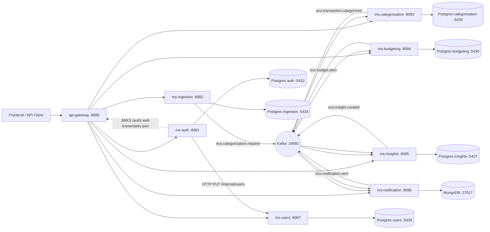

# 🌱 EcoFy — Financial Automation & Data Intelligence Platform
## 🌱 EcoFy — Plataforma de Automação Financeira e Inteligência de Dados

> **📌 Status / Maturidade:** projeto de **portfólio/estudos** com práticas profissionais — arquitetura hexagonal, event‑driven com **Transactional Outbox** e **DLT**, segurança JWT/JWKS com rotação de chave, idempotência com constraint de banco como árbitro. A stack completa sobe com `docker compose up -d`. **Não está pronto para produção:** há falhas de autorização em aberto, listadas em **[Limitações](#-known-limitations--limitações-conhecidas)**.
>
> **📌 Status / Maturity:** a **portfolio/study** project built with professional practices — hexagonal architecture, event‑driven with **Transactional Outbox** and **DLT**, JWT/JWKS security with key rotation, idempotency arbitrated by database constraints. The full stack starts with `docker compose up -d`. **Not production‑ready:** there are open authorization gaps, listed under **[Known Limitations](#-known-limitations--limitações-conhecidas)**.

---

## 📌 Overview | Visão Geral

**EN:** **EcoFy** is a backend platform based on **event-driven microservices**, designed to **organize, centralize, and transform raw financial data** (bank statements, transactions, financial events) into **structured, categorized, and actionable information**. It simulates how **fintechs, digital banks, and financial-management platforms** process financial data with **security, traceability, and modularity**.

**PT:** O **EcoFy** é uma plataforma backend orientada a **microsserviços e eventos**, projetada para **organizar, centralizar e transformar dados financeiros brutos** (extratos, transações e eventos) em **informações estruturadas, categorizadas e acionáveis**. Simula como **fintechs, bancos digitais e plataformas de gestão financeira** processam dados com **segurança, rastreabilidade e isolamento de responsabilidades**.

---

## 🎯 What the Platform Does | O que a Plataforma Faz

**EN:** EcoFy enables users and integrated systems to:
- import bank files (CSV / OFX) and ingest financial events;
- categorize transactions automatically (rules) or manually;
- manage budgets and spending limits, tracking consumption;
- generate insights, metrics, trends and dashboards;
- trigger multichannel notifications from financial events.

**PT:** O EcoFy permite que usuários e sistemas integrados:
- importem arquivos bancários (CSV / OFX) e ingiram eventos financeiros;
- categorizem transações automaticamente (regras) ou manualmente;
- gerenciem orçamentos e limites de gastos, acompanhando o consumo;
- gerem insights, métricas, tendências e dashboards;
- disparem notificações multicanal a partir de eventos financeiros.

> **EN:** In short — EcoFy turns unstructured financial data into actionable knowledge.
> **PT:** Em resumo — o EcoFy transforma dados financeiros desestruturados em conhecimento acionável.

---

## 🧭 Architecture Overview | Visão Geral da Arquitetura

**EN:** Event-driven architecture with **Kafka** as the central event bus, a single **API Gateway** entry point, and **JWT/JWKS** authentication issued by `ms-auth` and validated by each service (OAuth2 Resource Server). Every service follows **Hexagonal Architecture (Ports & Adapters)** — the domain has no dependency on Spring/JPA/Kafka.

**PT:** Arquitetura orientada a eventos com **Kafka** como barramento central, **API Gateway** como ponto único de entrada e autenticação **JWT/JWKS** emitida pelo `ms-auth` e validada por cada serviço (OAuth2 Resource Server). Todos os serviços seguem **Arquitetura Hexagonal (Ports & Adapters)** — o domínio não depende de Spring/JPA/Kafka.

A detailed C4 context diagram is available at **[docs/architecture/c4-context.md](docs/architecture/c4-context.md)**.

### 🗺️ System Diagram (implemented components) | Diagrama do Sistema (componentes implementados)



> **EN:** *Planned infrastructure not yet implemented:* Redis (cache/idempotency hot-reads), OpenSearch (search), Schema Registry. Referenced in the roadmap only.
> **PT:** *Infraestrutura planejada ainda não implementada:* Redis (cache/idempotência), OpenSearch (busca), Schema Registry. Apenas no roadmap.

---

## 🧩 Microservices | Microsserviços

| Service | Port | context-path | Responsibility (EN) | Responsabilidade (PT) | README |
|---|---:|---|---|---|---|
| **api-gateway** | 8080 | — | Single HTTP entry point, static routing, preserves `Authorization` | Entrada HTTP única, roteamento estático, preserva `Authorization` | [↗](api-gateway/README.md) |
| **ms-auth** | 8081 | `/auth` | AuthN/AuthZ (OIDC/JWT RS256), JWKS, register/login/refresh/validate | AutenticAção/AutorizAção (JWT RS256), JWKS, registro/login/refresh/validate | [↗](ms-auth/README.md) |
| **ms-users** | 8087 | `/users` | Profiles, preferences, connections, sync from ms-auth | Perfis, preferências, conexões, sync do ms-auth | [↗](ms-users/README.md) |
| **ms-ingestion** | 8082 | `/ingestion` | CSV/OFX upload, ImportJob, RawTransaction, publishes categorization requests | Upload CSV/OFX, ImportJob, RawTransaction, publica pedidos de categorização | [↗](ms-ingestion/README.md) |
| **ms-categorization** | 8083 | `/categorization` | Auto/manual categorization, publishes categorized events | Categorização auto/manual, publica eventos categorizados | [↗](ms-categorization/README.md) |
| **ms-budgeting** | 8084 | `/budgeting` | Budgets, BudgetConsumption, BUDGET_ALERT | Orçamentos, BudgetConsumption, BUDGET_ALERT | [↗](ms-budgeting/README.md) |
| **ms-insights** | 8085 | `/insights` | Dashboard, goals, metrics, insight.created | Dashboard, goals, métricas, insight.created | [↗](ms-insights/README.md) |
| **ms-notification** | 8086 | `/notification` | Multichannel notifications (real providers in `prod`/`sandbox`, console in `dev`/`test`), templates, delivery attempts | Notificações multicanal (providers reais em `prod`/`sandbox`, console em `dev`/`test`), templates, tentativas de entrega | [↗](ms-notification/README.md) |

---

## ⚙️ Technology Stack | Stack Tecnológica

| Área | Tecnologia |
|---|---|
| Language / Linguagem | **Java 25** |
| Framework | **Spring Boot 4** (WebMVC + WebFlux no gateway) |
| Security / Segurança | Spring Security **OAuth2 Resource Server** (JWT via JWKS) |
| Messaging / Mensageria | **Apache Kafka** (bus único) |
| Relational DB / Banco relacional | **PostgreSQL 16** + **Flyway** (migrations) |
| Document DB / Banco documental | **MongoDB 7** (ms-notification) |
| Gateway | **Spring Cloud Gateway** (WebFlux) |
| Docs | **springdoc-openapi** (Swagger UI) |
| Observability / Observabilidade | **Spring Boot Actuator** (health/info/prometheus) |
| Build | **Maven** (wrapper `mvnw` por serviço) |
| Infra local | **Docker Compose** (Kafka, Postgres, Mongo, Maildev) |

---

## ✅ Prerequisites | Pré-requisitos

**EN / PT:**
- **JDK 25** (required to compile `--release 25`).
- **Docker + Docker Compose** (local infrastructure).
- Maven wrapper (`mvnw`) is included per service.

---

## 🚀 How to Run Locally | Como Rodar Localmente

**EN:** all 8 services are containerized (multi-stage, JRE 25, non-root, actuator `HEALTHCHECK`). Three ways to run — details in **[infra/docker/README.md](infra/docker/README.md)**.

**PT:** os 8 serviços são containerizados (multi-stage, JRE 25, usuário não-root, `HEALTHCHECK` no actuator). Três modos de execução — detalhes em **[infra/docker/README.md](infra/docker/README.md)**.

### 1️⃣ Full stack | Stack completa

```bash
docker compose up -d --build      # infrastructure + 8 services | infraestrutura + 8 serviços
docker compose ps                 # status and health | estado e health
docker compose logs -f ms-auth    # logs of one service | logs de um serviço
docker compose down               # stop, keep volumes | derruba, preserva volumes
```

Gateway at `http://localhost:8080`. The first run compiles all services inside the images and takes a few minutes.
Gateway em `http://localhost:8080`. A primeira execução compila tudo dentro das imagens e leva alguns minutos.

### 2️⃣ One service at a time | Um serviço por vez

```bash
# infrastructure once | infraestrutura uma vez
docker compose -f infra/docker/docker-compose.infra.yml up -d

# then only the service under test | depois só o serviço em análise
docker compose -f infra/docker/ms-categorization/docker-compose.yml up -d --build
```

**EN:** per-service Compose files contain **only the application** and attach to the external `ecofy-net` network — they do not recreate databases or the broker.
**PT:** os Compose por serviço contêm **apenas a aplicação** e se anexam à rede externa `ecofy-net` — não recriam bancos nem broker.

### 3️⃣ Infrastructure in Docker, service in the IDE | Infra no Docker, serviço na IDE

```bash
docker compose -f infra/docker/docker-compose.infra.yml up -d
cd ms-budgeting && ./mvnw spring-boot:run    # needs JDK 25 | requer JDK 25
```

**Recommended order to exercise the pipeline | Ordem recomendada para exercitar o pipeline:**
`ms-auth` → `ms-users` → `ms-ingestion` → `ms-categorization` → `ms-budgeting` → `ms-insights` → `ms-notification` → `api-gateway`.

> **EN:** Kafka topics are created automatically by `kafka-init`. To create them explicitly:
> `bash infra/kafka/scripts/wait-for-kafka.sh && bash infra/kafka/scripts/create-topics.sh`
> **PT:** os tópicos Kafka são criados automaticamente pelo `kafka-init`. Para criá-los explicitamente, use os scripts acima.

> **EN:** `.env.example` documents every variable with the exact names read by the `application.yml` files. Copy it to `.env` and adjust.
> **PT:** o `.env.example` documenta todas as variáveis com os nomes exatos lidos pelos `application.yml`. Copie para `.env` e ajuste.

---

## 🧪 How to Run Tests | Como Executar Testes

```bash
# per service (JDK 25) | por serviço
cd ms-budgeting && JAVA_HOME=~/.jdks/openjdk-25.0.1 ./mvnw clean test
# build jar | empacotar
./mvnw clean package
```

**EN:** broad automated suite (unit, `@WebMvcTest` slices, security, Kafka consumers/publishers, mappers), plus **integration tests against real infrastructure**: `ms-ingestion` validates DLT routing against a real Kafka broker (payload preserved, no stack trace leaked in headers); `ms-users` validates the unique constraint under concurrency against a real PostgreSQL via Testcontainers.

**PT:** suíte automatizada ampla (unitários, slices `@WebMvcTest`, segurança, consumers/publishers Kafka, mappers), além de **testes de integração contra infraestrutura real**: o `ms-ingestion` valida o roteamento para DLT contra um broker Kafka real (payload preservado, sem stack trace nos headers); o `ms-users` valida a unique constraint sob concorrência contra um PostgreSQL real via Testcontainers.

> ⚠️ **EN:** three services currently have **pre-existing failures**, an accepted consequence of the improvement cycles (the standing instruction was "do not change tests"): `ms-budgeting` (48 assertion failures — exception messages were standardized), `ms-insights` (test compile error — `Money` became decimal), `ms-notification` (1 failure — backoff ceiling became configurable). None is a configuration or Spring context failure. A separate workstream is addressing them.
> ⚠️ **PT:** três serviços têm **falhas pré-existentes**, consequência aceita dos ciclos de melhoria (a instrução vigente era "não alterar testes"): `ms-budgeting` (48 falhas de asserção — mensagens de exception padronizadas), `ms-insights` (erro de compilação de teste — `Money` passou a decimal), `ms-notification` (1 falha — teto de backoff virou configurável). Nenhuma é falha de configuração ou de contexto Spring. Uma frente separada trata disso.

---

## 📖 Swagger / OpenAPI & Actuator

**EN / PT:** Each service exposes Swagger UI and Actuator (paths include the `context-path`):

| Serviço | Swagger UI | Health |
|---|---|---|
| ms-auth | `http://localhost:8081/auth/swagger-ui.html` | `/auth/actuator/health` |
| ms-users | `http://localhost:8087/users/swagger-ui.html` | `/users/actuator/health` |
| ms-ingestion | `http://localhost:8082/ingestion/swagger-ui.html` | `/ingestion/actuator/health` |
| ms-categorization | `http://localhost:8083/categorization/swagger-ui.html` | `/categorization/actuator/health` |
| ms-budgeting | `http://localhost:8084/budgeting/swagger-ui.html` | `/budgeting/actuator/health` |
| ms-insights | `http://localhost:8085/insights/swagger-ui.html` | `/insights/actuator/health` |
| ms-notification | `http://localhost:8086/notification/swagger-ui.html` | `/notification/actuator/health` |
| api-gateway | — | `http://localhost:8080/actuator/health` |

> **EN:** `health/info/prometheus` are public by design; business endpoints require JWT in `prod`. The gateway's operational `gateway` endpoint is **not** exposed in `default`/`prod` (only in `dev`).
> **PT:** `health/info/prometheus` são públicos por decisão; endpoints de negócio exigem JWT em `prod`. O endpoint operacional `gateway` **não** é exposto em `default`/`prod` (só em `dev`).

---

## 🔐 Authentication Flow | Fluxo de Autenticação

**EN:**
1. Client registers/logs in via the gateway (`POST /auth/api/auth/...`) against **ms-auth**.
2. **ms-auth** issues a **JWT (RS256)** and, after registration, **syncs the profile to ms-users** via internal HTTP `PUT /internal/users/{authUserId}` (header `X-Internal-Token`).
3. **ms-auth** exposes **JWKS** at `GET /auth/.well-known/jwks.json` (public).
4. The client sends `Authorization: Bearer <JWT>` to the gateway; the gateway **preserves** the header downstream.
5. Each service (**OAuth2 Resource Server**) validates the JWT signature against the JWKS and enforces access.

**PT:**
1. O cliente registra/faz login via gateway (`POST /auth/api/auth/...`) no **ms-auth**.
2. O **ms-auth** emite um **JWT (RS256)** e, após o registro, **sincroniza o perfil no ms-users** via HTTP interno `PUT /internal/users/{authUserId}` (header `X-Internal-Token`).
3. O **ms-auth** expõe o **JWKS** em `GET /auth/.well-known/jwks.json` (público).
4. O cliente envia `Authorization: Bearer <JWT>` ao gateway, que **preserva** o header downstream.
5. Cada serviço (**OAuth2 Resource Server**) valida a assinatura do JWT via JWKS e aplica o controle de acesso.

---

## 💸 Main Financial Flow | Fluxo Financeiro Principal

**EN / PT (event chain):**

```
upload CSV/OFX ──▶ ms-ingestion ──(eco.categorization.request)──▶ ms-categorization
   ms-categorization ──(eco.transaction.categorized)──▶ ms-budgeting + ms-insights
   ms-budgeting ──(eco.budget.alert)──▶ ms-notification + ms-insights
   ms-insights ──(eco.insight.created)──▶ ms-notification
```

**EN:** ingestion imports (streaming, bounded memory) and publishes categorization requests → categorization categorizes and publishes via Outbox → budgeting updates `BudgetConsumption` (idempotent) and emits `BUDGET_ALERT` when thresholds are crossed → insights aggregates metrics and emits `insight.created` → notification delivers through real providers (console in `dev`/`test`) and records every delivery attempt.

**PT:** ingestion importa (streaming, memória limitada) e publica pedidos de categorização → categorization categoriza e publica via Outbox → budgeting atualiza `BudgetConsumption` (idempotente) e emite `BUDGET_ALERT` ao cruzar limites → insights agrega métricas e emite `insight.created` → notification entrega pelos providers reais (console em `dev`/`test`) e registra cada tentativa.

**EN:** every hop carries `correlationId` and `causationId`, so a single upload can be traced end-to-end across five services.
**PT:** cada salto carrega `correlationId` e `causationId`, então um upload é rastreável ponta a ponta pelos cinco serviços.

---

## 📡 Kafka Events | Eventos Kafka

| Topic / Tópico | Producer / Produtor | Consumer(s) / Consumidor(es) | Partition key | Outbox | DLT |
|---|---|---|---|:--:|:--:|
| `eco.categorization.request` | ms-ingestion | ms-categorization (`ms-categorization-v2`) | transactionId | — | ✅ |
| `eco.transaction.categorized` | ms-categorization | ms-budgeting, ms-insights | transactionId | ✅ | ✅ |
| `eco.budget.alert` | ms-budgeting | ms-notification, ms-insights | userId | ✅ | ✅ |
| `eco.insight.created` | ms-insights | ms-notification | userId | ✅ | ✅ |
| `eco.notification.sent` | ms-notification | *(audit / auditoria)* | userId | ✅ | — |
| `eco.tx.raw` | *(external / externo)* | ms-ingestion | — | — | ✅ |
| `auth.user.registered` | ms-auth | ms-users | authUserId | — | 🟠 |
| `eco.categorization.applied` | ms-categorization | *(none / nenhum)* | transactionId | — | — |
| `eco.ingestion.transaction.imported` | ms-ingestion | *(none / nenhum)* | importJobId | — | — |
| `eco.ingestion.import-job.status-changed` | ms-ingestion | *(none / nenhum)* | importJobId | — | — |

**EN:** semantics are **at-least-once** — never exactly-once. Every consumer is idempotent, with a database constraint as the final arbiter. The **Transactional Outbox** writes the event in the same transaction as the domain change (the adapter uses `PROPAGATION_MANDATORY`, so writing outside the transaction is impossible), and a separate publisher delivers it afterwards with retry and broker confirmation. **DLT** routing distinguishes permanent errors (malformed JSON, unsupported version — straight to the DLT, no retry wasted) from transient ones (exponential backoff with a ceiling). Canonical topic documentation: **[infra/kafka/topics.yml](infra/kafka/topics.yml)**; event schemas: **[contracts/events](contracts/events)**.

**PT:** a semântica é **at-least-once** — nunca exactly-once. Todo consumer é idempotente, com constraint de banco como árbitro final. A **Transactional Outbox** grava o evento na mesma transação da mudança de domínio (o adapter usa `PROPAGATION_MANDATORY`, então gravar fora da transação é impossível), e um publisher separado o entrega depois, com retry e confirmação do broker. A **DLT** separa erro permanente (JSON malformado, versão não suportada — vai direto, sem gastar tentativa) de transitório (backoff exponencial com teto). Documentação canônica dos tópicos: **[infra/kafka/topics.yml](infra/kafka/topics.yml)**; schemas: **[contracts/events](contracts/events)**.

> 🟠 **EN:** `ms-users` is the only consumer **without a DLT**, and `topics.yml` still declares `auth.user.created` while the code uses `auth.user.registered` — the provisioning script creates the wrong topic. Both are open items.
> 🟠 **PT:** o `ms-users` é o único consumer **sem DLT**, e o `topics.yml` ainda declara `auth.user.created` enquanto o código usa `auth.user.registered` — o script de provisionamento cria o tópico errado. Ambos em aberto.

---

## 🛡️ Security by Profile | Segurança por Profile

| Profile | Business endpoints / Endpoints de negócio | JWT |
|---|---|---|
| `default` / `dev` | `permit-all=true` (facilita testes / eases testing) | opcional |
| `test` | `permit-all=true` | opcional |
| `prod` | `permit-all=false` | **required / exigido** |

**EN:** In all business services, `<svc>.security.permit-all` (env vars like `BGT_SECURITY_PERMIT_ALL`) toggles access; the **OAuth2 Resource Server (JWT) is always configured**. In `prod`, `JWT_JWKS_URI` is required and business endpoints demand a valid JWT.
**PT:** Em todos os serviços de negócio, `<svc>.security.permit-all` (env como `BGT_SECURITY_PERMIT_ALL`) controla o acesso; o **Resource Server JWT está sempre configurado**. Em `prod`, `JWT_JWKS_URI` é obrigatório e endpoints de negócio exigem JWT válido.

---

## 🔧 Main Environment Variables | Variáveis de Ambiente Principais

| Variable / Variável | Scope / Escopo | Default (dev) | Description / Descrição |
|---|---|---|---|
| `JWT_JWKS_URI` | all resource servers | `http://localhost:8081/auth/.well-known/jwks.json` | JWKS do ms-auth |
| `KAFKA_BOOTSTRAP_SERVERS` | all | `localhost:19092` | Kafka broker |
| `<SVC>_SECURITY_PERMIT_ALL` | business svcs | `true` dev / `false` prod | libera endpoints de negócio |
| `DB_URL` / `DB_USER` / `DB_PASS` | relational svcs | Postgres por serviço | banco relacional |
| `MONGO_URI` | ms-notification | `mongodb://localhost:27017/ecofy_notification` | banco documental |
| `USERS_MS_BASE_URL` / `INTERNAL_TOKEN` | ms-auth | `http://localhost:8087/users` / `local-internal-token` | sync auth→users |
| `SPRING_PROFILES_ACTIVE` | all | `default` | `dev` / `test` / `prod` |

**Ports / Portas:** gateway `8080`, auth `8081`, ingestion `8082`, categorization `8083`, budgeting `8084`, insights `8085`, notification `8086`, users `8087`. **Postgres:** auth `5432`, ingestion `5434`, categorization `5435`, budgeting `5436`, insights `5437`, users `5438`. **Mongo** `27017` · **Kafka** `19092` · **Maildev** `1025/1080`.

---

## 📂 Folder Structure | Estrutura de Pastas

```
ecofy-beckend/
├── api-gateway/            # Spring Cloud Gateway (routing)
├── ms-auth/                # AuthN/AuthZ, JWT, JWKS
├── ms-users/               # profiles, preferences, sync
├── ms-ingestion/           # CSV/OFX import, ImportJob
├── ms-categorization/      # auto/manual categorization
├── ms-budgeting/           # budgets, consumption, alerts
├── ms-insights/            # dashboard, goals, metrics, insights
├── ms-notification/        # notifications, templates (Mongo)
├── contracts/events/       # JSON schemas per event + version
├── infra/
│   ├── docker/             # infra compose + apps compose + per-service compose + README
│   └── kafka/              # topics.yml (canonical docs) + scripts
├── docs/
│   ├── architecture/       # C4 context diagram (Mermaid)
│   ├── apresentacao-tecnica-ecofy.md          # technical presentation
│   ├── avaliacao-tecnica-maturidade-ecofy.md  # assessment + maturity matrix
│   └── relatorios/         # technical reports per cycle
├── evidences/              # execution evidence + Postman collections
├── .env.example
├── EcoFy.postman_collection.json
└── docker-compose.yml      # includes infra + apps
```

**EN / PT:** every service has its own `Dockerfile` (multi-stage, JRE 25, non-root, actuator `HEALTHCHECK`) and `.dockerignore`.
Cada serviço tem `Dockerfile` próprio (multi-stage, JRE 25, não-root, `HEALTHCHECK` no actuator) e `.dockerignore`.

Each microservice follows Hexagonal Architecture: `core/domain`, `core/application`, `core/port/in|out`, `adapters/in|out`, `config`.

---

## 📮 Postman / Collections

**EN:** A Postman collection is available at the repo root (`EcoFy.postman_collection.json`) and additional collections/evidence under `evidences/`. Import into Postman and point the base URL to the gateway (`http://localhost:8080`).
**PT:** Há uma collection do Postman na raiz (`EcoFy.postman_collection.json`) e collections/evidências em `evidences/`. Importe no Postman e aponte a base para o gateway (`http://localhost:8080`).

---

## 🗺️ Roadmap | Roadmap

### ✅ Delivered | Entregue

Transactional Outbox (4 services) · DLT with error classification (5 services) · real notification providers by profile · real insight rebuild with checkpoint · external I/O moved out of transactions · `Money` value object · JWT ownership in `ms-users`/`ms-budgeting`/`ms-ingestion` · rate limiting + brute-force protection · key rotation with production guard · correlation/causation ID end-to-end · business metrics with controlled cardinality · full containerization · CI with Trivy scanning.

Outbox transacional (4 serviços) · DLT com classificação de erro (5 serviços) · providers reais por profile · rebuild real com checkpoint · I/O externo fora de transação · value object `Money` · ownership por JWT em `ms-users`/`ms-budgeting`/`ms-ingestion` · rate limiting + brute force · rotação de chave com guard de produção · correlation/causation ID ponta a ponta · métricas de negócio com cardinalidade controlada · containerização completa · CI com Trivy.

### 🔜 Next | Próximo

**Phase 1 — security blockers | Fase 1 — bloqueadores de segurança**
- JWT-derived ownership in `ms-insights` and `ms-notification` (see limitations).
- Strip `X-Internal-Token` at the gateway edge + production startup guard.
- Rotate the versioned RSA key and purge it from git history.

**Phase 2 — reliability | Fase 2 — confiabilidade**
- DLT for the `ms-users` consumer.
- Fix `topics.yml` (`auth.user.registered`).

**Phase 3 — operations | Fase 3 — operação**
- Administrative DLT replay (recovery is manual today).
- Distributed tracing (OpenTelemetry) — correlation ID links logs but gives no per-span latency across 5 async hops.
- Real static analysis in CI (currently a placeholder `echo`); image build/scan for all 8 services.
- Secret management; cross-cutting ADRs (money, ownership, event versioning, partition key).

> **EN / PT:** Kubernetes, Schema Registry and OpenSearch remain **out of scope by decision** — Compose covers the current need and `eventType`+`eventVersion` covers contract evolution at this scale.

---

## ⚠️ Known Limitations | Limitações Conhecidas

### 🔴 Open security gaps | Falhas de segurança em aberto

**EN:** found in the internal technical assessment (**[docs/avaliacao-tecnica-maturidade-ecofy.md](docs/avaliacao-tecnica-maturidade-ecofy.md)**). These are the reason the project is **not production-ready**.

**PT:** encontradas na avaliação técnica interna (link acima). São o motivo pelo qual o projeto **não está pronto para produção**.

- **`ms-insights` performs no identity check.** There is not a single reference to JWT or `SecurityContext` in its `src/main`. `GET /api/insights/v1/dashboard/{userId}` returns any user's dashboard. | **O `ms-insights` não verifica identidade.** Não há uma única referência a JWT ou `SecurityContext` no `src/main`. O endpoint de dashboard devolve os dados de qualquer usuário.
- **`ms-notification` likewise** — `GET /notifications?userId=X` lists any user's notifications. | **O `ms-notification` idem** — lista notificações de qualquer usuário.
- **Internal endpoint reachable from the edge.** The gateway forwards `/users/internal/**` and does not strip `X-Internal-Token`; the token's default is public and is not overridden in the `prod` profile. | **Endpoint interno alcançável pela borda.** O gateway encaminha `/users/internal/**` e não remove o `X-Internal-Token`; o default do token é público e não é sobrescrito no profile `prod`.
- **A private RSA key is versioned.** `ms-auth/src/main/resources/keys/ecofy-auth-private.pem` was deleted from the working tree but **remains in git history**. It must be treated as compromised and rotated. | **Chave privada RSA versionada.** O arquivo foi apagado da working tree mas **permanece no histórico do git**. Deve ser tratada como comprometida e rotacionada.

> **EN:** the ownership pattern exists and is correct in `ms-users`, `ms-budgeting` and `ms-ingestion` (derived from the JWT claim, client-supplied `userId` ignored). The issue is **incomplete coverage** of a decision already made — which is why it is cheap to close.
> **PT:** o padrão de ownership existe e está correto em `ms-users`, `ms-budgeting` e `ms-ingestion` (derivado da claim do JWT, com o `userId` do cliente ignorado). O problema é **cobertura incompleta** de uma decisão já tomada — por isso é barato de fechar.

### 🟠 Reliability and operations | Confiabilidade e operação

- **`ms-users` has no DLT** — a malformed message on `auth.user.registered` is redelivered indefinitely, stalling the identity partition. | **`ms-users` sem DLT** — mensagem malformada é reentregue indefinidamente, travando a partição do fluxo de identidade.
- **`topics.yml` declares `auth.user.created`** while the code uses `auth.user.registered`. | **`topics.yml` declara o tópico errado.**
- **No secret management** — everything is environment variables with development defaults. Only `ms-auth` fails startup on a missing secret. | **Sem gestão de secrets** — apenas o `ms-auth` derruba o startup se o segredo faltar.
- **No DLT replay tooling** — recovery requires manual intervention on the broker. | **Sem ferramenta de replay de DLT** — recuperação é manual no broker.
- **No distributed tracing** — correlation ID links logs but gives no per-span latency. | **Sem tracing distribuído.**

### 🟡 Known inconsistencies | Inconsistências conhecidas

- `ms-budgeting` returns the error code in `details.code` instead of top-level `errorCode`. | Contrato de erro divergente no `ms-budgeting`.
- Pagination differs across services (`PageResponse` / `PagedResponse` / plain `limit`). | Paginação divergente entre serviços.
- Four Outbox implementations with divergent naming — functionally equivalent, but they require four runbooks. | Quatro Outbox com nomenclatura divergente.
- `static-analysis` and `publish` are placeholders in the CI pipeline. | `static-analysis` e `publish` são placeholder no CI.
- Orphan producers: `eco.categorization.applied`, `eco.notification.sent` and the two `eco.ingestion.*` topics have no consumer. | Produtores órfãos sem consumidor.

---

## 🎓 Portfolio Note | Observação de Portfólio

**EN:** EcoFy was built as a **professional portfolio project** to demonstrate real-world backend architecture: event-driven microservices, hexagonal design, JWT/JWKS security, Kafka contracts between services, and financial-domain modeling — with an honest separation between what is **implemented** and what is **still open**.

What makes it worth reading is less the feature list and more the **defensive decisions** — the ones that only appear when someone thought about the failure mode: `PROPAGATION_MANDATORY` makes it *impossible* to write the Outbox outside the domain transaction; `ErrorHandlingDeserializer` prevents malformed JSON from becoming a poison pill inside `poll()`; strict charset decoding makes Latin-1 fail loudly instead of silently corrupting a financial description; the Outbox health indicator stays out of the liveness probe because restarting the pod does not fix the broker.

**PT:** O EcoFy foi construído como **projeto de portfólio profissional** para demonstrar arquitetura backend realista: microsserviços orientados a eventos, design hexagonal, segurança JWT/JWKS, contratos Kafka entre serviços e modelagem de domínio financeiro — com separação honesta entre o que está **implementado** e o que continua **em aberto**.

O que vale a leitura não é a lista de features, e sim as **decisões defensivas** — as que só aparecem quando alguém pensou no modo de falha: `PROPAGATION_MANDATORY` torna *impossível* gravar a Outbox fora da transação do domínio; `ErrorHandlingDeserializer` impede que JSON malformado vire poison pill dentro do `poll()`; a decodificação estrita faz Latin-1 falhar em vez de corromper silenciosamente uma descrição financeira; o health da Outbox fica fora do liveness porque reiniciar o pod não conserta o broker.

**EN / PT:** for the full assessment, maturity matrix per area and prioritised roadmap, see **[docs/avaliacao-tecnica-maturidade-ecofy.md](docs/avaliacao-tecnica-maturidade-ecofy.md)**.

---

**📌 Status:** continuously evolving | em evolução contínua
