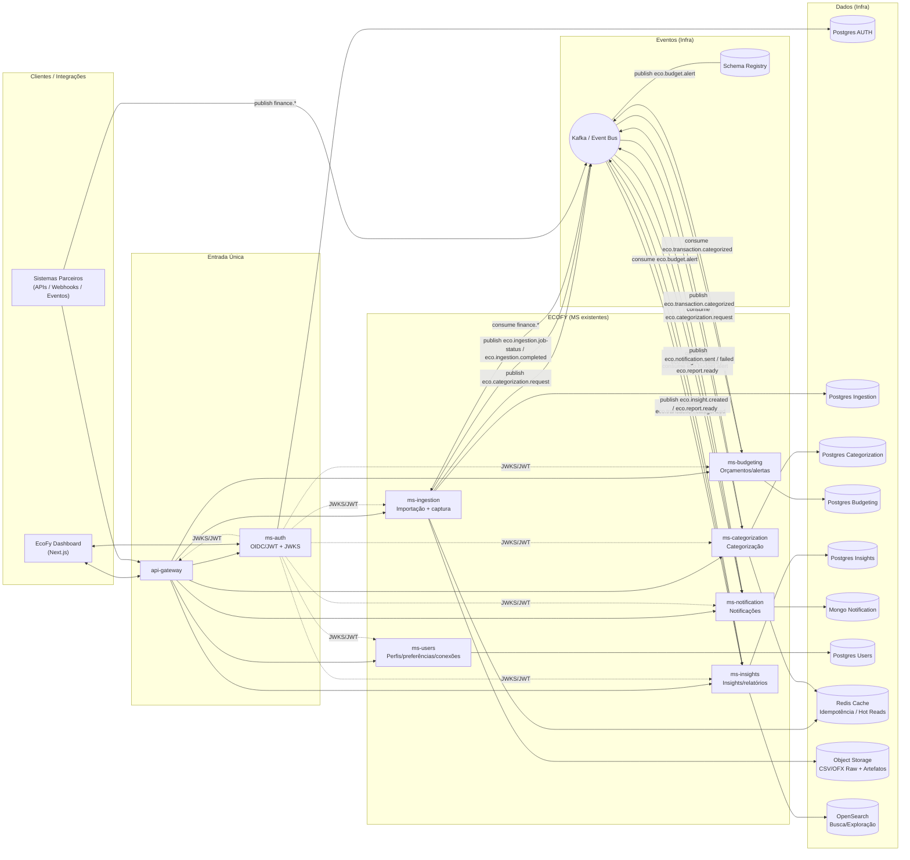

# 🌱 EcoFy — Financial Automation & Data Intelligence Platform  
## 🌱 EcoFy — Plataforma de Automação Financeira e Inteligência de Dados

---

## 📌 Overview | Visão Geral

**EcoFy** is a backend platform based on **event-driven microservices**, designed to **organize, centralize, and transform raw financial data** (bank statements, transactions, and financial events) into **structured, categorized, and actionable information**.

**EcoFy** simulates, in a realistic way, how **fintechs, digital banks, and financial management platforms** process financial data at scale with **security, traceability, and modularity**.

---

O **EcoFy** é uma plataforma backend orientada a **microsserviços e eventos**, projetada para **organizar, centralizar e transformar dados financeiros brutos** (extratos, transações e eventos financeiros) em **informações estruturadas, categorizadas e acionáveis**.

O projeto simula de forma realista como **fintechs, bancos digitais e plataformas de gestão financeira** processam dados financeiros com **escalabilidade, segurança e isolamento de responsabilidades**.

---

## 🎯 What the Platform Does | O que a Plataforma Faz

**EcoFy enables users and integrated systems to:**

- import bank files (CSV / OFX),
- ingest financial events in real time,
- categorize transactions automatically,
- manage budgets and spending limits,
- generate insights, metrics, and reports,
- trigger notifications based on financial events.

---

**O EcoFy permite que usuários ou sistemas integrados:**

- importem arquivos bancários (CSV / OFX),
- enviem eventos financeiros em tempo real,
- categorizem transações automaticamente,
- gerenciem orçamentos e limites de gastos,
- gerem insights, métricas e relatórios,
- disparem notificações baseadas em eventos financeiros.

---

In short:  
**EcoFy transforms unstructured financial data into actionable knowledge.**

Em resumo:  
**O EcoFy transforma dados financeiros desestruturados em conhecimento acionável.**

---

## 🧭 Architecture Overview | Visão Geral da Arquitetura

EcoFy is built on an **event-driven architecture**, using **Kafka as the central event bus**, protected by an **API Gateway** and **OIDC/JWT authentication**.

---

O EcoFy é construído sobre uma **arquitetura orientada a eventos**, utilizando **Kafka como barramento central**, protegido por **API Gateway** e **autenticação OIDC/JWT**.

---

## 🗺️ System Diagram | Diagrama do Sistema

> This diagram represents **only the microservices that exist in this repository**, including their connections to databases, cache, and Kafka.

> Este diagrama representa **apenas os microsserviços existentes neste repositório**, incluindo conexões com bancos, cache e Kafka.


---
# 🧩 Microservices | Microsserviços

## 🔐 api-gateway
*   **EN:** Single HTTP entry point. Routes requests, applies authentication, logging, and rate-limiting.
*   **PT:** Ponto único de entrada HTTP. Responsável por roteamento, autenticação, logging e rate-limit.

## 🔑 ms-auth
*   **EN:** Authentication and authorization service implementing OIDC/JWT, token issuance, validation, and JWKS exposure.
*   **PT:** Serviço de autenticação e autorização com OIDC/JWT, emissão e validação de tokens e JWKS.

## 📥 ms-ingestion
*   **EN:** Responsible for ingesting financial data via CSV/OFX files and Kafka events, managing import jobs, storing raw transactions, and publishing events for categorization.
*   **PT:** Responsável pela ingestão de dados financeiros via arquivos CSV/OFX e eventos Kafka, controle de jobs de importação, persistência de transações brutas e publicação de eventos para categorização.

## 🏷️ ms-categorization
*   **EN:** Automatically categorizes transactions based on rules and heuristics, supports manual categorization, and emits categorization events.
*   **PT:** Realiza a categorização automática de transações com base em regras, suporta categorização manual e publica eventos de categorização.

## 💰 ms-budgeting
*   **EN:** Manages budgets per category, tracks consumption, and triggers budget alerts when limits are exceeded.
*   **PT:** Gerencia orçamentos por categoria, controla consumo e dispara alertas quando limites são ultrapassados.

## 📊 ms-insights
*   **EN:** Generates financial insights, metrics, trends, and reports, providing aggregated data for dashboards.
*   **PT:** Gera insights financeiros, métricas, tendências e relatórios para visualização em dashboards.

## 🔔 ms-notification
*   **EN:** Sends notifications based on domain events (budget alerts, insights), supporting multiple delivery channels.
*   **PT:** Responsável pelo envio de notificações baseadas em eventos do domínio (alertas, insights), com múltiplos canais.

## 👤 ms-users
*   **EN:** Manages financial user profiles, preferences, linked accounts, and integrations with the authentication service.
*   **PT:** Gerencia o perfil financeiro do usuário, preferências, contas vinculadas e integração com o serviço de autenticação.


# 🏗️ Software Architecture | Arquitetura de Software

**EN:**  
All microservices follow Hexagonal Architecture (Ports & Adapters), ensuring low coupling, high testability, and clear separation of concerns.

**PT:**  
Todos os microsserviços seguem Arquitetura Hexagonal (Ports & Adapters), garantindo baixo acoplamento, alta testabilidade e separação clara de responsabilidades.


---


# ⚙️ Technology Stack | Stack Tecnológica

- **Language:** Java 21
- **Framework:** Spring Boot
- **Build Tool:** Maven (entire project)
- **Messaging:** Kafka
- **Database:** PostgreSQL
- **Caching:** Redis
- **Search & Analytics:** OpenSearch
- **Infrastructure:** Docker & Docker Compose


---
## 🚀 Quickstart (5 minutes) | Quickstart (5 minutos)

### ✅ Prerequisites | Pré-requisitos
- Docker + Docker Compose

---

### 1) Configure env | Configure o ambiente

**EN:**  
Copy the example env file and adjust if needed.

**PT:**  
Copie o arquivo de exemplo e ajuste se necessário.

```bash
cp infra/docker/.env.example infra/docker/.env
```

### 2) Start containers | Subir containers

#### 2.1 Full stack (all microservices) | Stack completo (todos os microsserviços)

**EN:**  
Start the full local stack using the **infra + apps** compose files.

**PT:**  
Suba o stack completo usando os arquivos de compose de **infra + apps**.

```bash
docker compose \
  -f infra/docker/docker-compose.infra.yml \
  -f infra/docker/docker-compose.apps.yml \
  --env-file infra/docker/.env \
  up -d
```

### 3) Open the entrypoint | Abrir o ponto de entrada (Gateway)

**Base URL (Gateway):**
- http://localhost:8080

**Gateway routes (by design):**
- `/auth/**` → ms-auth  
- `/ingestion/**` → ms-ingestion  
- `/categorization/**` → ms-categorization  
- `/budgeting/**` → ms-budgeting  
- `/insights/**` → ms-insights  
- `/notification/**` → ms-notification  
- `/users/**` → ms-users  

---

### 4) Create Kafka topics (optional) | Criar tópicos Kafka (opcional)

**EN:** If auto-create is disabled, create topics with the scripts.  
**PT:** Se auto-create estiver desabilitado, crie tópicos via scripts.

```bash
bash infra/kafka/scripts/wait-for-kafka.sh
bash infra/kafka/scripts/create-topics.sh
```

---

### 5) Postman collections (optional) | Collections do Postman (opcional)

**EN:**  
Postman collections and environment variables are available in `evidences/collection`. Import them into Postman to run the prepared requests quickly.

**PT:**  
As collections do Postman e as variáveis de ambiente estão disponíveis em `evidences/collection`. Importe no Postman para executar rapidamente os requests já preparados.


---


### 6) Stop | Parar

#### 6.1 Stop full stack | Parar stack completo
```bash
docker compose \
  -f infra/docker/docker-compose.infra.yml \
  -f infra/docker/docker-compose.apps.yml \
  --env-file infra/docker/.env \
  down
```

#### 6.2 Stop a single microservice | Parar um microsserviço isolado

Example (ms-users):

```bash
docker compose \
  -f infra/docker/ms-users/docker-compose.yml \
  --env-file infra/docker/.env \
  down
```

---

# 🐳 Local Execution | Execução Local

**EN:**  
This repository supports two execution modes:
- **Per-microservice Compose:** each microservice has its own Docker Compose file with **only the required infrastructure services** for that microservice (e.g., its database, Kafka, Redis, MongoDB, MailDev), making isolated execution and debugging easier.
- **Full stack Compose:** there is also a Docker Compose setup that starts **all required services and all microservices together**, recommended for end-to-end validation.

**PT:**  
Este repositório suporta dois modos de execução:
- **Compose por microsserviço:** cada microsserviço possui seu próprio Docker Compose com **apenas os serviços de infraestrutura necessários** para ele (ex.: seu banco, Kafka, Redis, MongoDB, MailDev), facilitando execução isolada e debug.
- **Compose do stack completo:** também existe um Docker Compose que sobe **todos os serviços necessários e todos os microsserviços juntos**, recomendado para validação end-to-end.

---

# 🧪 Tests & Evidence | Testes e Evidências

**EN:**
- Unit tests focused on domain and application layers.
- REST endpoint tests.
- Evidence of executions and test scenarios available in the `evidences/` folder (see `evidences`).

**PT:**
- Testes unitários focados no domínio e camadas de aplicação.
- Testes de endpoints REST.
- Evidências de execução e cenários disponíveis na pasta `evidences/` (veja `evidences`).
---

# 🚀 Project Purpose | Objetivo do Projeto


**EN:**  
EcoFy was built as a professional portfolio project, showcasing real-world backend architecture, event-driven design, and financial domain modeling.

**PT:**  
O EcoFy foi desenvolvido como um projeto de portfólio profissional, demonstrando arquitetura backend realista, design orientado a eventos e modelagem de domínio financeiro.


---


**📌 Status:** continuously evolving | em evolução contínua  
